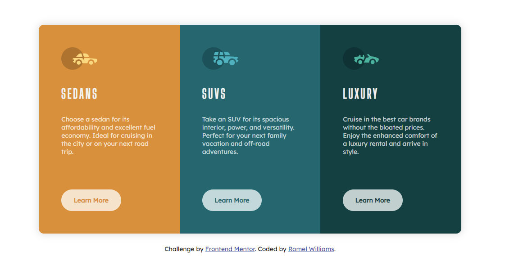

# Frontend Mentor - 3-column preview card component solution

This is a solution to the [3-column preview card component challenge on Frontend Mentor](https://www.frontendmentor.io/challenges/3column-preview-card-component-pH92eAR2-). Frontend Mentor challenges help you improve your coding skills by building realistic projects.

## Table of contents

- [Overview](#overview)
  - [The challenge](#the-challenge)
  - [Screenshot](#screenshot)
  - [Links](#links)
- [My process](#my-process)
  - [Built with](#built-with)
  - [What I learned](#what-i-learned)
  - [Continued development](#continued-development)
  - [Useful resources](#useful-resources)
- [Author](#author)

## Overview

### The challenge

Users should be able to:

- View the optimal layout depending on their device's screen size
- See hover states for interactive elements

### Screenshot



### Links

- Solution URL: [https://github.com/omerome83/3-Column-Preview-Card-Component](https://github.com/omerome83/3-Column-Preview-Card-Component)
- Live Site URL: [https://omerome83.github.io/3-Column-Preview-Card-Component/](https://omerome83.github.io/3-Column-Preview-Card-Component)

## My process

### Built with

- Semantic HTML5 markup
- CSS custom properties
- Flexbox

### What I learned

I created the layout with Flexbox for the first time and while it was a challenge, I am glad I stuck with it. Getting the items to lineup in each column was not easy, but I did my best. I still need to do one step at a time, but it's so exciting learning something new while at the same time trying to implement all of the things on the screen.

I had some additional challenges like the mouseover effect and how it can be implemented.

```css
background-color: initial;
border: 2px solid hsl(0, 0%, 100%, 0.75);
color: hsl(0, 0%, 100%, 0.75);
font-weight: 200;
```

This presented an additional issue. When moused-over, the page would slightly move downwards so after doing some googling, by adding a transparent border to the button itself, this piece of code fixed the issue.

```css
border: 2px solid transparent;
```

### Continued development

I hope to learn more about Flexbox and improve on my skills. Then eventually tackle CSSGrid. While understanding these layouts have a learning curve, so far, it is way better than doing things the "old" way with floats and clears!

### Useful resources

- [Stack Overflow](https://stackoverflow.com/questions/33924053/buttons-cut-in-half?rq=1) - This page was a great help when noticing that the buttons would render correctly when the page reaches a certain size in width. By changing the <a> tag of the button to display: inline-block was a great fix.
- [W3Schools](https://www.w3schools.com/css/css3_flexbox.asp) - Just what I needed to start my path on understanding Flexbox. Once again, the HTML window to try out code was a big help.

## Author

- Website - [Romel Williams](https://github.com/omerome83)
- Frontend Mentor - [@omerome83](https://www.frontendmentor.io/profile/omerome83)